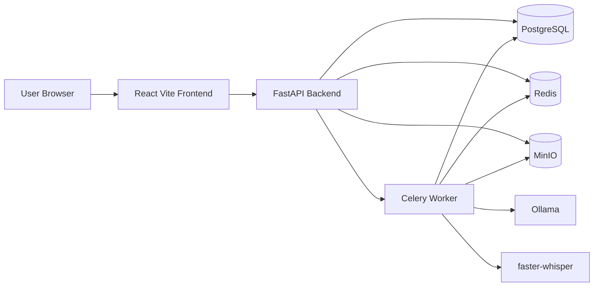

# Weekly Team Feedback Tool - Architecture

## Architecture goal

Build a local-first MVP that runs entirely in Docker Compose. The system should support the retrospective workflow from `_docs/plan.md` without provisioning any cloud infrastructure or creating cloud costs.

The selected stack is:

- Frontend: React with Vite
- Backend API: FastAPI
- Database: PostgreSQL
- Background jobs: Celery with Redis
- Object storage: MinIO
- Local AI and transcription: Ollama and faster-whisper
- Local infrastructure: Docker Compose only

## Versions

Use exact image tags instead of floating tags such as `latest`. These are the starting pins for the MVP and should only be changed intentionally.

- FastAPI base image: `python:3.12.11-slim-bookworm`
- React/Vite base image: `node:22.16.0-alpine3.22`
- PostgreSQL: `postgres:17.10-alpine3.24`
- Redis: `redis:8.0.5-alpine3.21`
- MinIO: `minio/minio:RELEASE.2025-09-07T16-13-09Z-cpuv1`
- Ollama: `ollama/ollama:0.12.10`

## High-level system

## Services

### Frontend

The frontend is a React application built with Vite. It owns the user-facing screens:

- Project page
- Feedback form
- Retrospective board
- Meeting upload page
- Retrospective summary

The frontend talks to the backend through HTTP APIs. If live updates become necessary for the retrospective board, the first option should be FastAPI WebSockets or simple polling before introducing more infrastructure.

### Backend API

The FastAPI service owns the application rules and exposes the API used by the frontend. It should handle:

- Projects and team membership
- Facilitator and team member permissions
- Feedback cycles
- Start, Stop, Continue feedback cards
- Anonymous submission behavior
- Reveal, cluster, vote, and discuss stages
- Meeting uploads
- Review and approval of extracted decisions and action items
- Published retrospective summaries

The backend should keep AI-generated results as drafts until the facilitator confirms them, matching the MVP decision in `_docs/plan.md`.

### PostgreSQL

PostgreSQL is the main source of truth for structured application data:

- Users
- Projects
- Feedback cycles
- Feedback cards
- Clusters
- Votes
- Discussion notes
- Decisions
- Action items
- Uploaded meeting metadata
- Transcript and extraction job status

### Redis and Celery

Redis is used as the Celery broker for background work. Celery workers should handle slow or non-request work, such as:

- Processing uploaded meeting files
- Running transcription
- Running AI extraction
- Generating draft summaries
- Future long-running maintenance jobs

The initial MVP tasks should include Celery and Redis only when the app first needs background processing. The AI/transcription workloads should be added later because they are heavier on a low-spec laptop.

### Celery and Redis for background jobs

**Decision:** Use Celery with Redis for background job processing.

**Why:** The app needs background work for uploads, transcription, AI extraction, and summary generation. Celery is a mature Python-native worker system, and Redis is lightweight on resources for the MVP while still being enough for a local Docker Compose setup.

**Alternatives considered:**

- FastAPI `BackgroundTasks`: simpler, but too limited for durable, inspectable, long-running work.
- RQ or Dramatiq: lighter alternatives, but Celery is more widely documented and gives more room for retries, routing, and future worker separation.
- Full workflow orchestrators: more powerful, but too heavy for the MVP and low-spec local development.

### MinIO

MinIO provides S3-compatible object storage locally. It stores uploaded files such as:

- Audio files
- Video files
- Transcript files
- Any intermediate processing artifacts worth preserving

The app should treat MinIO as object storage from the beginning instead of storing large uploads directly in PostgreSQL.

### Ollama and faster-whisper

Ollama provides local LLM inference for clustering, extraction, and summary generation. faster-whisper provides local transcription when the facilitator uploads audio or video.

These services are part of the chosen architecture, but they should be sequenced late in the backlog. Early tasks should focus on the core retrospective workflow, database model, frontend screens, and Docker Compose foundation before adding local AI workloads.

For local development on a low-spec laptop, the Compose setup should make AI services optional, for example by using Compose profiles or separate commands so the main app can run without starting Ollama or transcription workers.

## Core data flow

### Feedback collection

1. A facilitator creates a project and feedback cycle.
2. Team members submit Start, Stop, and Continue cards through the frontend.
3. The backend stores cards in PostgreSQL.
4. Before reveal, team members can only see and edit their own cards.
5. Anonymous cards remain anonymous in all user-facing views.

### Retrospective board

1. The facilitator starts the retrospective and reveals cards.
2. The backend returns all revealed cards to the frontend.
3. Clusters can be suggested by AI later, but manual clustering should work first.
4. Team members vote on clusters.
5. The backend stores votes and returns ranked discussion topics.
6. The facilitator marks topics as discussed, skipped, or deferred.

### Meeting processing

1. The facilitator uploads audio, video, transcript file, or pasted transcript text.
2. The backend stores uploaded files in MinIO and metadata in PostgreSQL.
3. The backend enqueues processing jobs in Celery.
4. Celery workers run transcription when needed.
5. Celery workers run extraction and summary generation.
6. Draft decisions, action items, owners, due dates, and summaries are saved in PostgreSQL.
7. The facilitator reviews, edits, and confirms the drafts.

## Local development infrastructure

Docker Compose is the only infrastructure tool for now. It should eventually define:

- `frontend`
- `api`
- `worker`
- `postgres`
- `redis`
- `minio`
- `ollama` as an optional later service

The Compose setup should support:

- Local development with mounted source code
- Database persistence through Docker volumes
- MinIO persistence through Docker volumes
- Health checks for core services
- Running tests inside containers
- Optional AI services so the core app remains usable on low-spec hardware

No Terraform, Pulumi, Kubernetes, cloud provider services, or managed AI services should be introduced for the MVP unless the project direction changes.

## Backlog sequencing note

When this architecture is broken into implementation tasks, prioritize the lightweight foundation first:

1. Empty project with passing tests
2. Docker Compose foundation
3. Backend API skeleton
4. Frontend skeleton
5. Database schema and migrations
6. Core project and feedback workflow
7. Retrospective board workflow
8. Upload and background-job foundation
9. Local AI clustering, transcription, extraction, and summary generation

The AI/transcription work should be one of the later task groups because Ollama and faster-whisper can be resource-intensive on a low-spec laptop.
